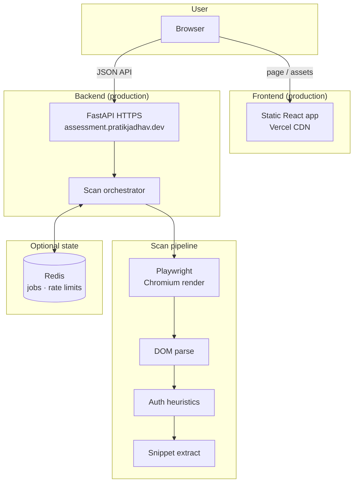

# Auth Snippet Discovery API

Full-stack app for authentication snippet discovery. The backend accepts a public HTTPS URL, loads the page with headless Chromium (Playwright), analyzes the rendered DOM, and returns whether authentication-related markup was found along with a bounded HTML snippet when possible. The frontend provides a scan UI with result states, snippet rendering, and optional debug diagnostics.

The design follows **FastAPI + async**, layered services, **URL safety checks**, rate limiting, and optional **Redis-backed** state (jobs + rate limits). **Production is split:** the UI is a static SPA on **Vercel** and the API is served under its own HTTPS host. **Nginx** appears only in **local Docker Compose** as a convenience reverse proxy.

## Live deployment

- **Frontend:** [https://assessment-get-covered.vercel.app/](https://assessment-get-covered.vercel.app/)
- **Backend API:** [https://assessment.pratikjadhav.dev](https://assessment.pratikjadhav.dev)

## Architecture (high level)



**Local demos** can still use **Docker Compose** with Nginx → API on `localhost` (see below); that path is not used in production.

- **Stateful pieces** (jobs, rate limit counters) are behind interfaces so `STATE_BACKEND` can switch between in-memory and Redis without changing route handlers.
- **Scans** default to synchronous `POST /api/scan`; heavy workloads can use **async jobs** (`POST /api/scan/jobs` + poll).

## Tech stack

- **Python 3.12+**, **FastAPI**, **Pydantic**
- **Playwright** (Chromium) for JS-rendered pages
- **BeautifulSoup + lxml** for DOM analysis
- **Redis** (optional) for distributed-friendly rate limiting and job metadata
- **uv** for dependency management (`pyproject.toml` + `uv.lock`)
- **Docker Compose** (local only): Nginx + API + Redis

## Repository layout

```text
.
├── backend/
│   ├── Dockerfile              # Playwright base image + uv sync
│   └── app/
│       ├── main.py             # FastAPI app, lifespan, wiring
│       ├── api/                # routes, schemas
│       ├── core/               # settings, logging
│       ├── security/           # URL validation, DNS safety
│       └── services/           # browser, DOM, detector, orchestrator, cache, jobs
├── frontend/
│   ├── src/                    # React + TypeScript UI
│   └── .env.example            # VITE_API_BASE_URL
├── nginx/
│   └── nginx.conf              # Reverse proxy to backend
├── docker-compose.yml          # local: Nginx + API + Redis
├── render.yaml                 # Render Blueprint (API + Redis; see below)
├── pyproject.toml
├── uv.lock
├── .env.example
├── api.md                      # backend HTTP API reference
├── Plan.md                     # original product/architecture notes
└── README.md
```

## Quick start (local, no Docker)

1. Install [uv](https://docs.astral.sh/uv/) and **Playwright browsers** (Chromium):

   ```bash
   uv sync
   uv run playwright install chromium
   ```

2. Run the API (uses `STATE_BACKEND=memory` unless you set Redis in env):

   ```bash
   uv run uvicorn app.main:app --app-dir backend --reload
   ```

3. Health check:

   ```bash
   curl http://127.0.0.1:8000/health
   ```

4. Scan (example):

   ```bash
   curl -sS -X POST http://127.0.0.1:8000/api/scan \
     -H 'Content-Type: application/json' \
     -d '{"url":"https://github.com/login"}'
   ```

## Docker Compose (recommended for demos)

Compose runs **Nginx on port 80**, **API** (internal), and **Redis**. Environment is loaded from `.env` if present, otherwise from `.env.example`.

```bash
cp .env.example .env   # optional: edit values
docker compose up -d --build
```

- Public API base URL: `http://localhost`
- Health: `GET http://localhost/health`
- Metrics (JSON): `GET http://localhost/metrics` (via Nginx → backend)

## Render (optional API hosting)

The **live** app uses a **split** deploy (Vercel UI + API on `assessment.pratikjadhav.dev`). **Render** is documented here as one way to run the API (and Redis) if you are not using that stack.

**Render does not run `docker compose up`.** Use the repo’s **[render.yaml](render.yaml)** [Blueprint](https://docs.render.com/docs/infrastructure-as-code) so the **same logical stack** as Compose is created there: **FastAPI from `backend/Dockerfile` + Render Key Value (Redis)**. Nginx is only needed locally for multi-backend routing; on Render, traffic goes straight to the web service (HTTPS at the edge).

1. Push this repo to GitHub/GitLab/Bitbucket.
2. In the Render dashboard: **New → Blueprint** → connect the repo → apply `render.yaml`.
3. The API **start command** is already set in Blueprint as `dockerCommand` (Uvicorn on **`$PORT`**). You do not paste a separate “start command” unless you edit the Blueprint.
4. Set `STATE_BACKEND=redis` and `REDIS_URL` from the Key Value instance (both are defined in `render.yaml`).
5. Deploy the **frontend** as a **Static Site** (or other host): set `VITE_API_BASE_URL` to your Render API URL (e.g. `https://auth-snippet-api.onrender.com`).

Playwright/Chromium is memory-heavy; if the service OOMs, upgrade the web service **plan** in the dashboard.

## Frontend (React + TypeScript)

The frontend is a standalone Vite app that calls the backend API and renders:

- URL submission with validation
- scan lifecycle (`idle`, `loading`, `done`, `error`)
- result state badge (`found`, `not_found`, `protected_or_blocked`, etc.)
- detection signals
- returned auth HTML snippet with copy action
- optional debug diagnostics (`debug=true`)

Run locally:

```bash
cd frontend
cp .env.example .env
npm install
npm run dev
```

By default, `.env.example` points to `http://localhost`, which matches the Compose/Nginx setup.

To tear down (and remove Redis volume):

```bash
docker compose down -v
```

## Environment variables

See `.env.example` for the full set. Important knobs:

| Variable | Purpose |
|----------|---------|
| `REQUEST_TIMEOUT_MS` | Overall scan wall-clock budget (orchestrator) |
| `GOTO_TIMEOUT_MS` | Playwright navigation timeout |
| `DOM_SETTLE_TIMEOUT_MS` | Extra settle wait after navigation |
| `MAX_CONCURRENT_SCANS` | Semaphore limiting concurrent browser sessions |
| `MAX_REDIRECT_HOPS` | Reject scans after too many redirects |
| `RESULT_CACHE_TTL_SECONDS` | Short-TTL cache of scan results by normalized URL |
| `STATE_BACKEND` | `memory` or `redis` |
| `REDIS_URL` | e.g. `redis://redis:6379/0` in Compose |
| `CORS_ALLOW_ORIGINS` | Comma-separated allowed browser origins for CORS |
| `RATE_LIMIT_*` | Per-client sliding window for API endpoints |

## API reference

Full documentation for all routes, JSON schemas, rate limits, and `curl` examples lives in **[api.md](api.md)**.

While the server is running you can also use the built-in OpenAPI UI (e.g. `http://localhost:8000/docs` locally, or `http://localhost/docs` when using Docker Compose behind Nginx).

## Safety notes

The URL boundary is treated as **untrusted**:

- Only `http`/`https`
- Host and resolved IPs must be **public** (no loopback/private ranges)
- Redirect hop limit
- Read-only navigation (no credential submission)

Do **not** use this service to probe internal networks or evade site protections.

## Why some sites differ from your browser

Bots and datacenter IPs often see **challenge / CAPTCHA / “just a moment”** pages that your personal browser does not. The `debug=true` flag helps compare what the server actually rendered versus what you see locally. `protected_or_blocked` is returned when multiple strong signals indicate a challenge page rather than login markup.

## Tests

```bash
uv sync
uv run pytest
```

## License / product

This repository is built for an assessment/demo (see `Plan.md` for product intent). Adjust licensing as needed for your organization.
